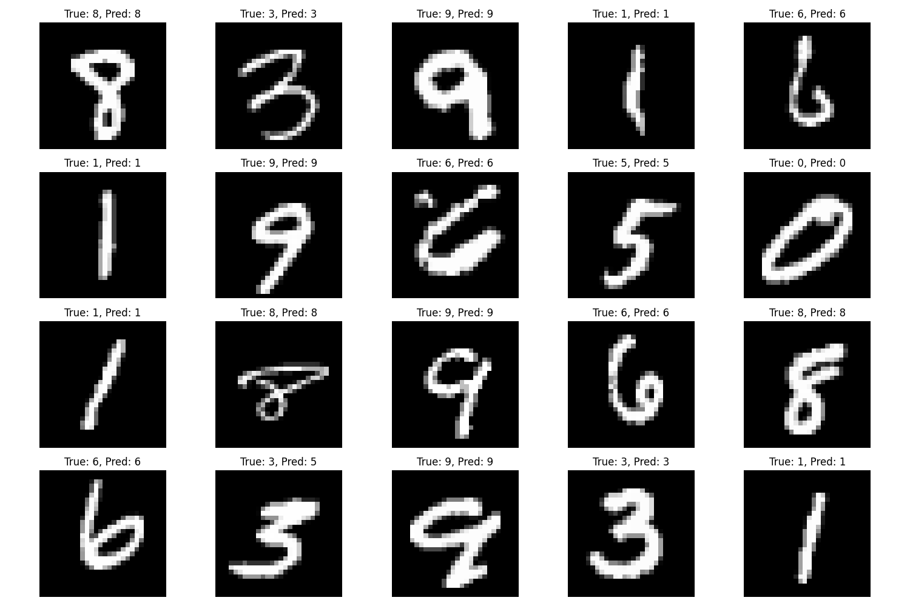
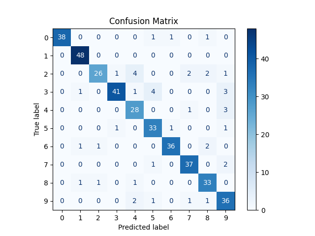

# Rational Function-Based Multi-Class Classifier

## Overview

This project implements a **Rational Function-based Classifier** for the MNIST handwritten digit dataset.  
Unlike standard machine learning models, this classifier models the decision boundary as a **ratio of polynomials** and optimizes the coefficients using **linear programming** with a **bisection search**.

The classifier was developed **independently** as part of a special academic research project, showcasing:

- Mathematical formulation of non-linear classification
- Custom optimization using linear programming  
- Multi-class extension with One-vs-All strategy  
- PCA-based dimensionality reduction  

---

## Original Contribution

- **Rational Function Approximation**: Models the classifier as \( f(x) = P(x) / Q(x) \) where \(P\) and \(Q\) are polynomials of degrees `n` and `m`.  
- **Multi-class Classification**: One-vs-All approach for digits 0–9.  
- **Optimization Pipeline**:  
  - Linear programming formulation for classification constraints  
  - Bisection search to find the optimal decision parameter `z`  
- **Dimensionality Reduction**: PCA applied before classification to reduce computational complexity  

> This work is fully implemented from scratch and does not rely on pre-built classifiers for the main algorithm.

---

## Project Structure
rational-approximation/
│
├── main.py # Entry point: runs the full experiment

├── requirements.txt # Python dependencies

├── README.md

├── results/ # Folder where results (plots, reports) are stored

├── src/

│ ├── rational_classifier.py # Class definition

│ ├── utils.py # Helper functions for polynomial expansion

│ └── optimization.py # LP solver and bisection search

---

## Installation

1. Clone the repository:

git clone https://github.com/Heludave8/rational-approximation.git
cd rational-approximation

2. Install dependencies:

pip install -r requirements.txt
Requirements include: numpy, scikit-learn, scipy, matplotlib

### Usage

Run the main experiment:

python main.py

### What will happen:

Load a subset of the MNIST dataset (default: 2000 samples)
Normalize features and split into training/test sets
Apply PCA for dimensionality reduction
Train the RationalClassifier
Evaluate the model:Prints accuracy,Prints classification report,shows confusion matrix
Visualize sample predictions (20 images)

### Results

All results are saved in the results/ folder:
confusion_matrix.png → Confusion matrix of predictions
classification_report.txt → Detailed precision, recall, F1-score
sample_predictions.png → Sample test images with true vs predicted labels

Example accuracy:
Accuracy: 0.87

(Your results may vary depending on subset size and random seed)

### Visualization

Sample predictions:

Confusion matrix:

### Customization

You can modify:

Subset size in main.py (to reduce computation time)
PCA components: n_components
Rational function degrees: numerator_degree and denominator_degree
classifier = RationalClassifier(numerator_degree=2, denominator_degree=1, n_components=n_components)

### Key Learnings

How to implement a custom ML algorithm from scratch
Application of linear programming for classification
Use of bisection method for parameter tuning
Dimensionality reduction using PCA for optimization efficiency
Visualization and evaluation of classifier performance

### References / Inspiration

MNIST dataset: https://www.openml.org/d/554
Polynomial approximation techniques
Linear programming-based optimization
